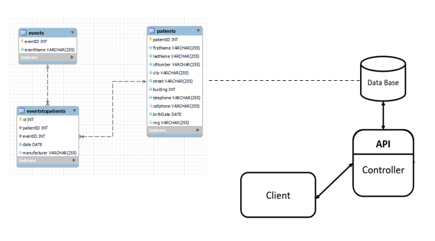
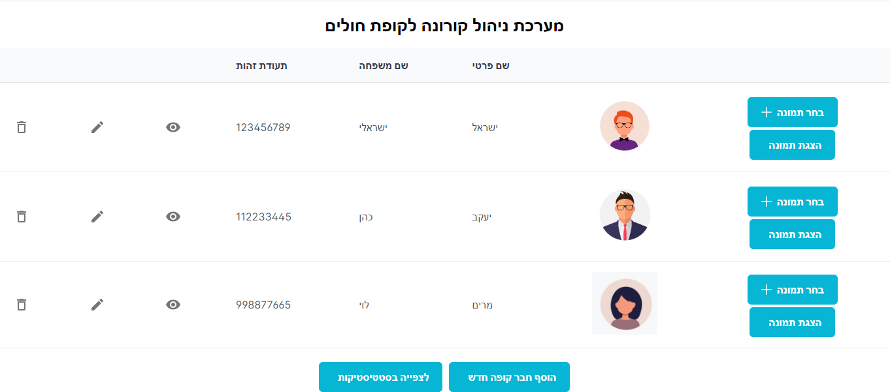
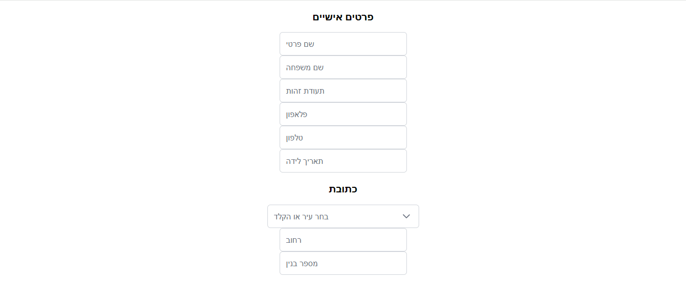
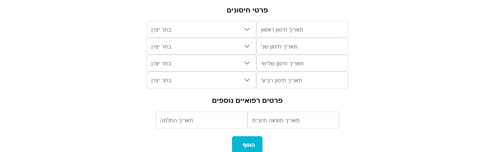
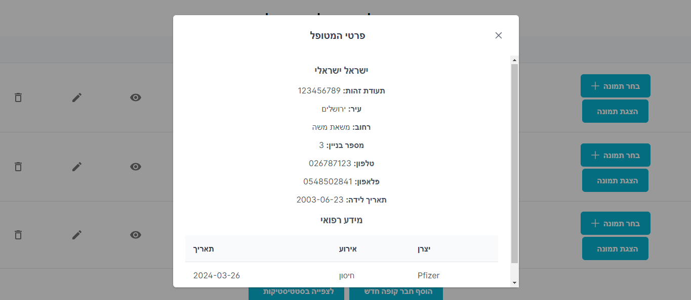
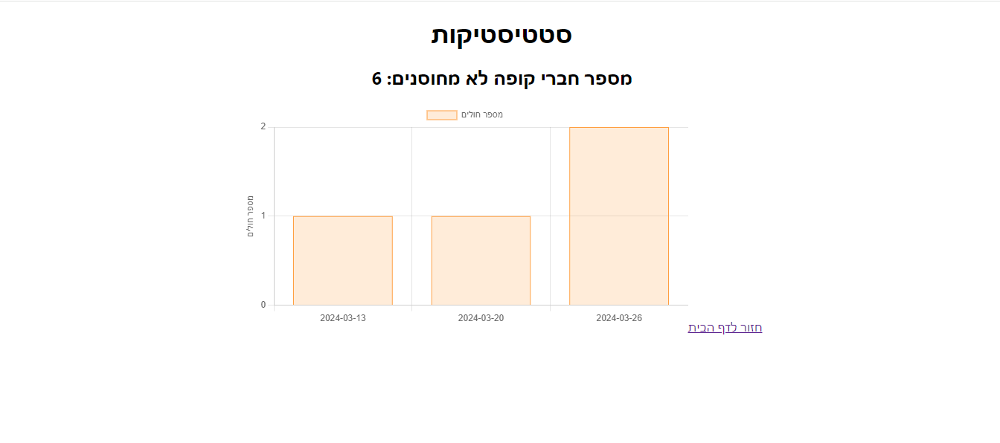

# Health Maintenance Organization Management System

## Description

This project is a management system for a large health fund, designed to handle Corona records efficiently. It enables the health fund to maintain a comprehensive database of its members, allowing easy access, editing, adding and deletion of member records. Built with Node.js, React, and MySQL, the system provides a user-friendly interface for administrators to manage data related to Corona, ensuring timely and accurate record-keeping.

## Features

- **View Members**: Browse a list of health fund members.
- **Add Member**: Add new member to the system.
- **Edit Member Profiles**: Modify details of member profiles.
- **Delete Member**: Remove member records from the system.
- **Upload Member Pictures**: Add or update members' photographs.
- **View Statistics**: Access visual statistics related to Corona.
- **Corona Record Management**: Maintain detailed records of Corona cases within the database.

## Architecture

## Screens

## Prerequisites

Before setting up the project, ensure you have the following installed:
- **Node.js**: Follow the installation guide at [nodejs.org](https://nodejs.org/en/).
- **create-react-app**: Install this globally to easily run the project and build source files. Use `npm install -g create-react-app` in your terminal.

## Cloning and Running the Application Locally

1. **Clone the Project**: Clone the repository to your local machine using `git clone https://github.com/Riki-Student/HomeTest.git`.
2. **Install NPM Packages**: Navigate to the project directory and execute `npm install` to install all required npm packages.
3. **Run the Application**: Start the application by running `npm start`. This will launch the app in your default web browser.

The application will run on [localhost:3000](http://localhost:3000).
